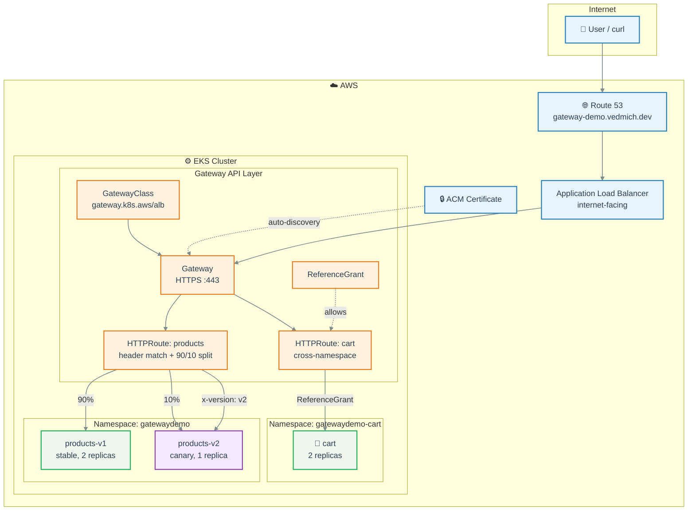
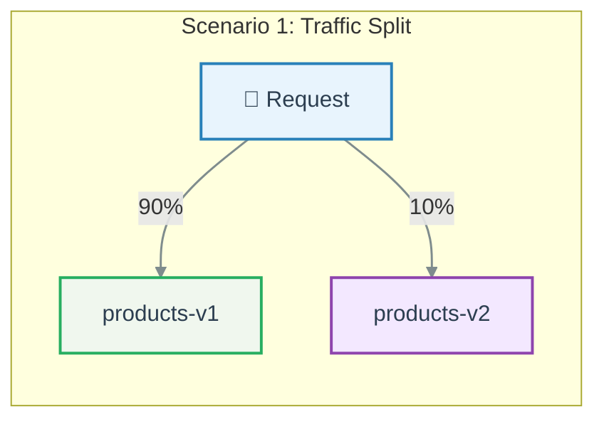
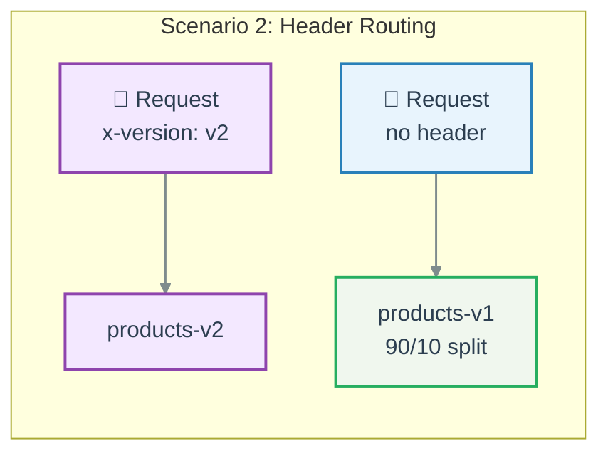
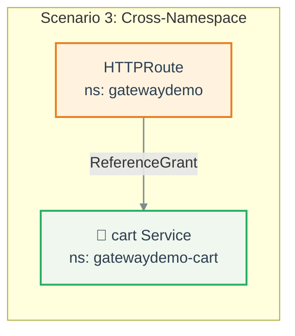
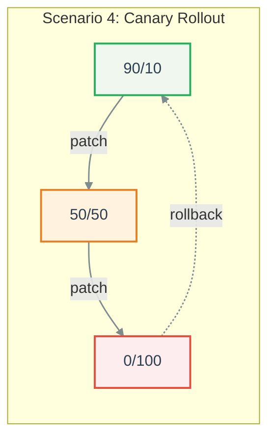

# Hands-On Labs

Complete labs for the DKT episode: migrating from Kubernetes Ingress to Gateway API on AWS.

## Architecture



## Lab Overview

| Lab | Title | Duration | What You Learn |
|-----|-------|----------|----------------|
| [Lab 0](lab-00-setup.md) | Initial Setup | ~20 min | Provision EKS, build images, deploy apps |
| [Lab 1](lab-01-nginx-migration.md) | NGINX Ingress -> Gateway API | ~15 min | Controller swap migration with ingress2gateway |
| [Lab 2](lab-02-alb-migration.md) | ALB Ingress -> Gateway API | ~10 min | API swap migration (annotations -> CRDs) |
| [Lab 3](lab-03-demo-scenarios.md) | Gateway API Scenarios | ~20 min | Traffic split, header routing, cross-ns, canary |

## Prerequisites

- AWS account with EKS, VPC, ALB, ACM, ECR, Route 53 permissions
- `terraform >= 1.5`, `kubectl >= 1.30`, `docker`, [task](https://taskfile.dev)
- Python 3.12+ and [uv](https://docs.astral.sh/uv/) (for running tests)
- `aws` CLI configured with appropriate credentials

## Quick Start

```bash
git clone https://github.com/DKT-AI/gateway-api-migration-demo.git
cd gateway-api-migration-demo

# Provision everything
task infra:init && task infra:apply   # ~15 min
task images:build && task images:push
task deploy:apps

# Jump to any lab
open docs/labs/lab-01-nginx-migration.md
```

## Demo Scenarios








