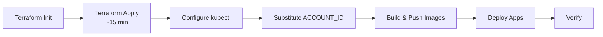
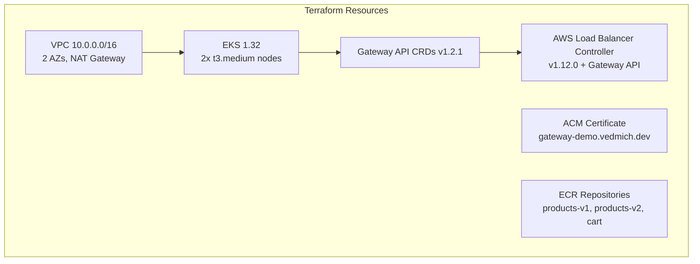
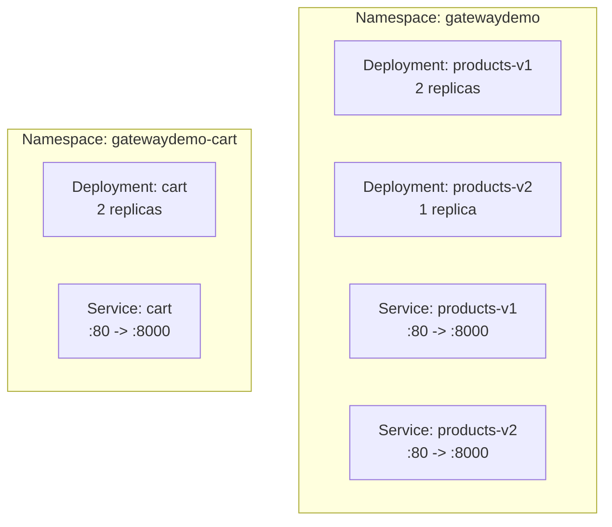

# Lab 0: Initial Setup

Provision the EKS cluster, build container images, and deploy the base applications.

**Duration:** ~20 minutes (mostly waiting for EKS provisioning)



---

## 0.1 Clone the repository

```bash
git clone https://github.com/DKT-AI/gateway-api-migration-demo.git
cd gateway-api-migration-demo
```

## 0.2 Provision infrastructure

```bash
task infra:init
task infra:apply
```

This creates:



Expected: all resources provisioned (~15 min).

## 0.3 Configure kubectl

```bash
CLUSTER_NAME=$(cd terraform && terraform output -raw cluster_name)
REGION=$(cd terraform && terraform output -raw region)
aws eks update-kubeconfig --name "$CLUSTER_NAME" --region "$REGION"
```

**Verify:**

```bash
kubectl get nodes
```

```
# Expected:
NAME                                          STATUS   ROLES    AGE   VERSION
ip-10-0-x-x.eu-central-1.compute.internal    Ready    <none>   5m    v1.32.x
ip-10-0-x-x.eu-central-1.compute.internal    Ready    <none>   5m    v1.32.x
```

## 0.4 Substitute ACCOUNT_ID in manifests

All manifests use `ACCOUNT_ID` as a placeholder for the ECR image URLs.

```bash
ACCOUNT_ID=$(cd terraform && terraform output -raw account_id)

# Replace placeholder in all manifests
find manifests/ -name '*.yaml' -exec sed -i.bak "s/ACCOUNT_ID/$ACCOUNT_ID/g" {} +
find manifests/ -name '*.bak' -delete

# Replace CERTIFICATE_ARN in ALB ingress
CERT_ARN=$(cd terraform && terraform output -raw acm_certificate_arn)
sed -i.bak "s|CERTIFICATE_ARN|$CERT_ARN|g" manifests/03-ingress-alb/ingress.yaml
rm -f manifests/03-ingress-alb/ingress.yaml.bak
```

## 0.5 Build and push images

```bash
task images:build
task images:push
```

Expected: 3 images built and pushed to ECR (products-v1, products-v2, cart).

## 0.6 Deploy base applications

```bash
task deploy:apps
```

This deploys Deployments and Services into two namespaces:



**Verify:**

```bash
kubectl -n gatewaydemo get pods
```

```
# Expected:
NAME                           READY   STATUS    RESTARTS   AGE
products-v1-xxxxxxxxxx-xxxxx   1/1     Running   0          30s
products-v1-xxxxxxxxxx-xxxxx   1/1     Running   0          30s
products-v2-xxxxxxxxxx-xxxxx   1/1     Running   0          30s
```

```bash
kubectl -n gatewaydemo-cart get pods
```

```
# Expected:
NAME                    READY   STATUS    RESTARTS   AGE
cart-xxxxxxxxxx-xxxxx   1/1     Running   0          30s
cart-xxxxxxxxxx-xxxxx   1/1     Running   0          30s
```

---

**Next:** Choose your migration path:
- [Lab 1: NGINX Ingress -> Gateway API](lab-01-nginx-migration.md) (controller swap)
- [Lab 2: ALB Ingress -> Gateway API](lab-02-alb-migration.md) (API swap)
