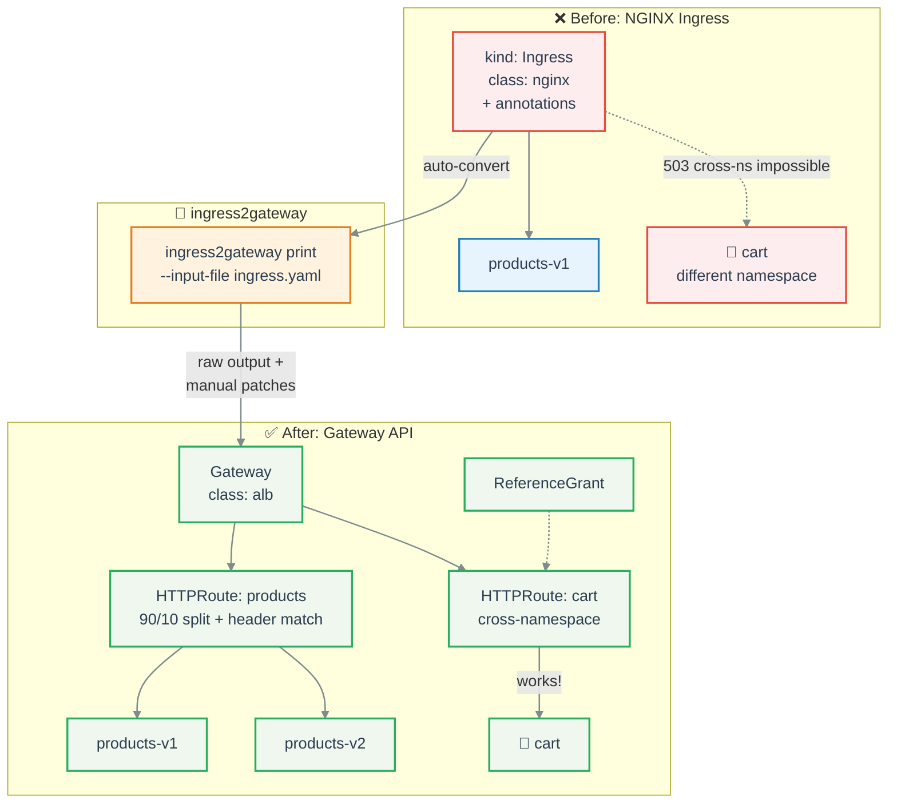
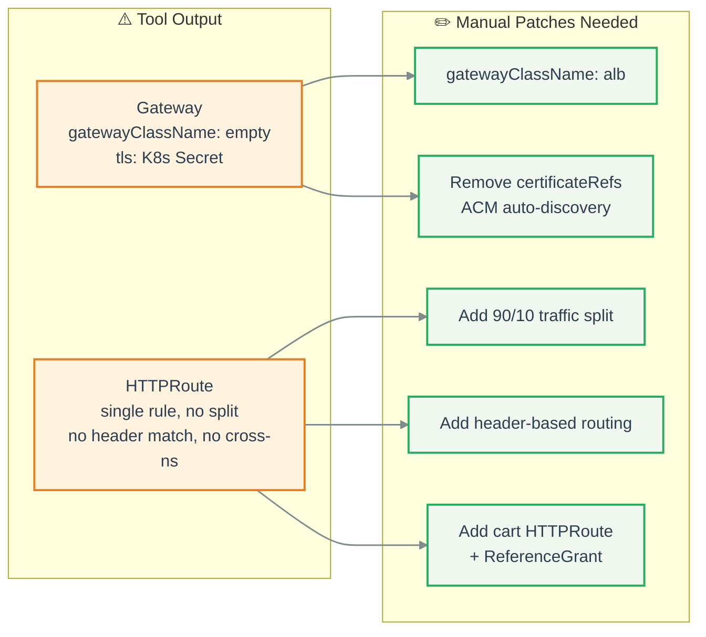
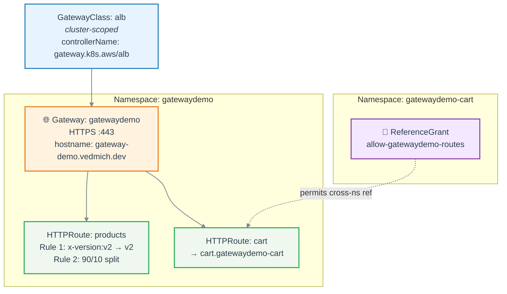

# Lab 1: NGINX Ingress -> Gateway API

**Scenario:** You have ingress-nginx and need to migrate to Gateway API (controller swap).

**Duration:** ~15 minutes

**Prerequisite:** [Lab 0](lab-00-setup.md) completed (apps deployed, images pushed).

## Migration Flow



## What changes in migration

| Feature | NGINX Ingress | Gateway API |
|---------|--------------|-------------|
| Traffic splitting | Canary annotations (weight) | HTTPRoute `backendRefs` with `weight` |
| Header routing | Canary annotations (header) | HTTPRoute `matches.headers` |
| Cross-namespace | Not possible (503) | ReferenceGrant handshake |
| TLS | K8s Secret (`secretName`) | ACM auto-discovery by hostname |
| Config | Untyped annotations | Typed CRD fields |

---

## Step 1.1: Deploy NGINX Ingress (starting point)

```bash
task deploy:ingress-nginx
```

**Verify:**

```bash
kubectl -n gatewaydemo get ingress
```

```
# Expected:
NAME          CLASS   HOSTS                       ADDRESS   PORTS     AGE
gatewaydemo   nginx   gateway-demo.vedmich.dev              80, 443   10s
```

**Key limitation to observe:**

```yaml
# manifests/02-ingress-nginx/ingress.yaml (excerpt)
paths:
  - path: /api/products
    backend:
      service:
        name: products-v1   # OK - same namespace
        port: { number: 80 }
  - path: /api/cart
    backend:
      service:
        name: cart           # FAILS - cart is in gatewaydemo-cart namespace
        port: { number: 80 } # Ingress cannot cross namespaces -> 503
```

> **Key takeaway:** Ingress cannot reference Services across namespaces. This is a fundamental limitation that Gateway API solves.

## Step 1.2: Run ingress2gateway conversion

```bash
# Install (if not already)
go install github.com/kubernetes-sigs/ingress2gateway@latest

# Convert and inspect
ingress2gateway print \
  --input-file manifests/02-ingress-nginx/ingress.yaml
```

### What the tool generates vs what we need



Compare the raw output (`manifests/05-migration/nginx-converted.yaml`) with the final result (`manifests/04-gateway-api/`):

```bash
diff manifests/05-migration/nginx-converted.yaml manifests/04-gateway-api/gateway.yaml
```

**Key gaps in tool output:**
- `gatewayClassName` is empty -- needs `"alb"`
- TLS uses K8s Secret -- AWS ALB Controller uses ACM auto-discovery
- No traffic splitting -- was commented-out annotations
- No cross-namespace routing -- was impossible in Ingress
- No header-based routing -- was canary annotation

> **Takeaway:** ingress2gateway is a migration *assistant*, not a one-shot replacement. Always review and patch the output.

## Step 1.3: Apply Gateway API resources

The patched, production-ready manifests are in `manifests/04-gateway-api/`:

```bash
kubectl apply -f manifests/04-gateway-api/
```

This creates 5 resources:



**Verify:**

```bash
kubectl -n gatewaydemo get gateway
```

```
# Expected:
NAME          CLASS   ADDRESS                                PROGRAMMED   AGE
gatewaydemo   alb     k8s-gatewayd-xxxxxx.eu-central-1...   True         60s
```

```bash
kubectl -n gatewaydemo get httproute
```

```
# Expected:
NAME       HOSTNAMES                        PARENTREFS             AGE
products   ["gateway-demo.vedmich.dev"]     ["gatewaydemo"]        60s
cart       ["gateway-demo.vedmich.dev"]     ["gatewaydemo"]        60s
```

```bash
kubectl -n gatewaydemo-cart get referencegrant
```

```
# Expected:
NAME                        AGE
allow-gatewaydemo-routes    60s
```

## Step 1.4: Test routing

**Products endpoint:**

```bash
curl -s https://gateway-demo.vedmich.dev/api/products | jq '.[0]'
```

```json
{"id": 1, "name": "Wireless Keyboard", "price": 49.99, "category": "electronics"}
```

**Cart endpoint (cross-namespace -- this NOW works via ReferenceGrant!):**

```bash
curl -s https://gateway-demo.vedmich.dev/api/cart/demo-user | jq
```

```json
{"user_id": "demo-user", "items": [], "total": 0}
```

## Step 1.5: Run E2E tests

```bash
task test:e2e
```

Expected: all tests pass.

## Step 1.6: Cleanup (before next lab)

```bash
kubectl delete -f manifests/04-gateway-api/
kubectl delete -f manifests/02-ingress-nginx/
```

---

**Next:** [Lab 2: ALB Ingress -> Gateway API](lab-02-alb-migration.md) or skip to [Lab 3: Demo Scenarios](lab-03-demo-scenarios.md)
