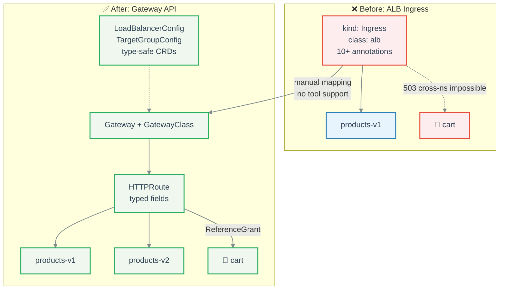
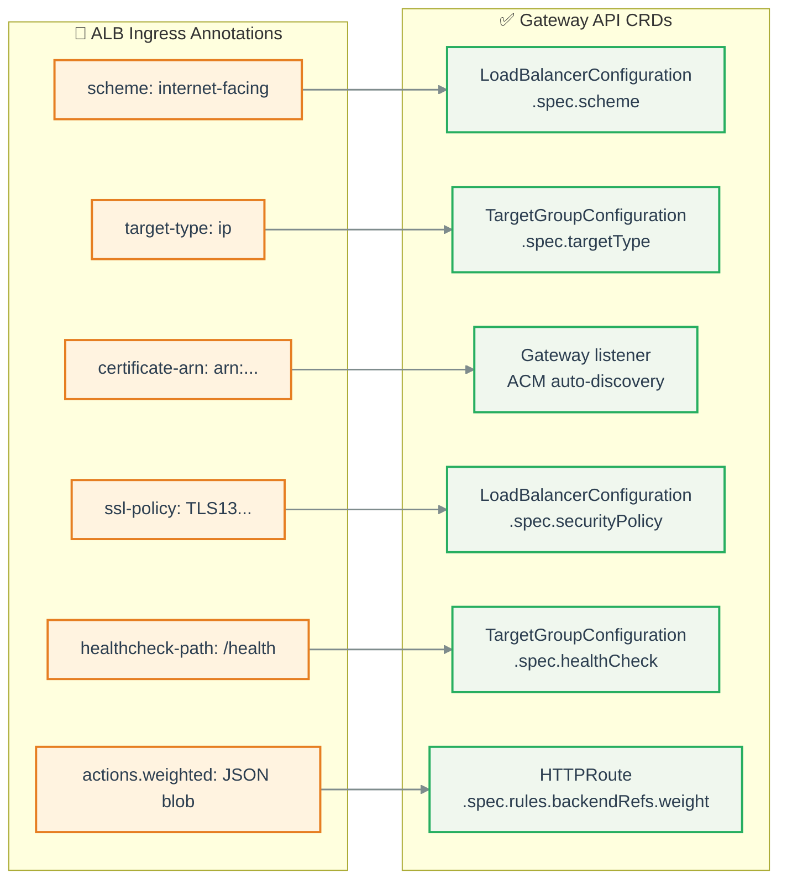

# Lab 2: ALB Ingress -> Gateway API

**Scenario:** You have AWS ALB Controller with `kind: Ingress` + annotations and want to migrate to Gateway API (API swap, same controller).

**Duration:** ~10 minutes

**Prerequisite:** [Lab 0](lab-00-setup.md) completed. If you did Lab 1, make sure you ran the cleanup step.

## Migration Flow



> **Key difference from Lab 1:** No ingress2gateway tool for ALB annotations. This is a manual mapping from untyped annotation strings to type-safe CRDs.

## Annotation -> CRD Mapping



Full mapping table:

| ALB Annotation | Gateway API Equivalent |
|---|---|
| `scheme` | Gateway annotation or LoadBalancerConfiguration CRD |
| `target-type` | TargetGroupConfiguration CRD |
| `listen-ports` | Gateway `spec.listeners` |
| `certificate-arn` | ACM auto-discovery by hostname (not K8s Secrets) |
| `ssl-policy` | LoadBalancerConfiguration CRD |
| `healthcheck-*` | TargetGroupConfiguration `healthCheck` |
| `actions.*` (weighted JSON) | HTTPRoute `backendRefs` with `weight` |
| `conditions.*` | HTTPRoute `matches` (path, headers) |

See `manifests/05-migration/alb-mapping.yaml` for full CRD examples.

---

## Step 2.1: Deploy ALB Ingress (starting point)

```bash
task deploy:ingress-alb
```

**Verify:**

```bash
kubectl -n gatewaydemo get ingress
```

```
# Expected:
NAME          CLASS   HOSTS                       ADDRESS                              PORTS   AGE
gatewaydemo   alb     gateway-demo.vedmich.dev    k8s-gatewayd-xxxxxx.eu-central-1..   80      30s
```

**Observe the annotations:**

```bash
kubectl -n gatewaydemo get ingress gatewaydemo -o yaml | head -25
```

Notice: 10+ annotations containing strings, JSON blobs, and magic values. Errors in these annotations are only caught at runtime (or silently ignored).

## Step 2.2: Review the Before and After

**Before** (`manifests/03-ingress-alb/ingress.yaml`):

```yaml
annotations:
  alb.ingress.kubernetes.io/scheme: internet-facing
  alb.ingress.kubernetes.io/target-type: ip
  alb.ingress.kubernetes.io/listen-ports: '[{"HTTPS":443}]'
  alb.ingress.kubernetes.io/certificate-arn: arn:aws:acm:...
  alb.ingress.kubernetes.io/ssl-policy: ELBSecurityPolicy-TLS13-1-2-2021-06
  alb.ingress.kubernetes.io/healthcheck-path: /health
  alb.ingress.kubernetes.io/healthcheck-interval-seconds: "15"
  # ... more annotations
```

**After** (`manifests/04-gateway-api/`): typed fields, validated at apply time:

```yaml
# GatewayClass -- who manages the LB
apiVersion: gateway.networking.k8s.io/v1
kind: GatewayClass
metadata:
  name: alb
spec:
  controllerName: gateway.k8s.aws/alb

# Gateway -- the LB itself
apiVersion: gateway.networking.k8s.io/v1
kind: Gateway
metadata:
  name: gatewaydemo
spec:
  gatewayClassName: alb
  listeners:
    - name: https
      protocol: HTTPS
      port: 443
      hostname: gateway-demo.vedmich.dev
      tls:
        mode: Terminate  # ACM auto-discovery by hostname

# HTTPRoute -- routing rules
apiVersion: gateway.networking.k8s.io/v1
kind: HTTPRoute
spec:
  rules:
    - matches:
        - path: { type: PathPrefix, value: /api/products }
      backendRefs:
        - name: products-v1
          weight: 90   # typed integer, not JSON string
        - name: products-v2
          weight: 10
```

> **Key advantage:** Typo in an annotation = silent failure. Typo in a CRD = rejected at `kubectl apply`.

## Step 2.3: Switch from Ingress to Gateway API

```bash
kubectl delete -f manifests/03-ingress-alb/
kubectl apply -f manifests/04-gateway-api/
```

**Verify:**

```bash
kubectl -n gatewaydemo get gateway,httproute
```

```
# Expected:
NAME                                             CLASS   ADDRESS                              PROGRAMMED   AGE
gateway.gateway.networking.k8s.io/gatewaydemo    alb     k8s-gatewayd-xxxxxx.eu-central-1..   True         60s

NAME                                           HOSTNAMES                        AGE
httproute.gateway.networking.k8s.io/products   ["gateway-demo.vedmich.dev"]     60s
httproute.gateway.networking.k8s.io/cart       ["gateway-demo.vedmich.dev"]     60s
```

## Step 2.4: Test

```bash
# Products
curl -s https://gateway-demo.vedmich.dev/api/products | jq '.[0]'
# Expected: {"id": 1, "name": "Wireless Keyboard", ...}

# Cart (cross-namespace -- works now!)
curl -s https://gateway-demo.vedmich.dev/api/cart/demo-user | jq
# Expected: {"user_id": "demo-user", "items": [], "total": 0}
```

## Step 2.5: Cleanup (optional)

Only clean up if you want to start Lab 3 fresh:

```bash
kubectl delete -f manifests/04-gateway-api/
```

---

**Next:** [Lab 3: Demo Scenarios](lab-03-demo-scenarios.md) (keep Gateway API resources deployed!)
