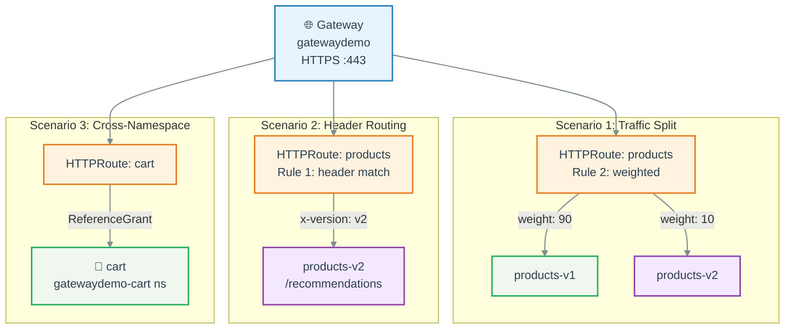
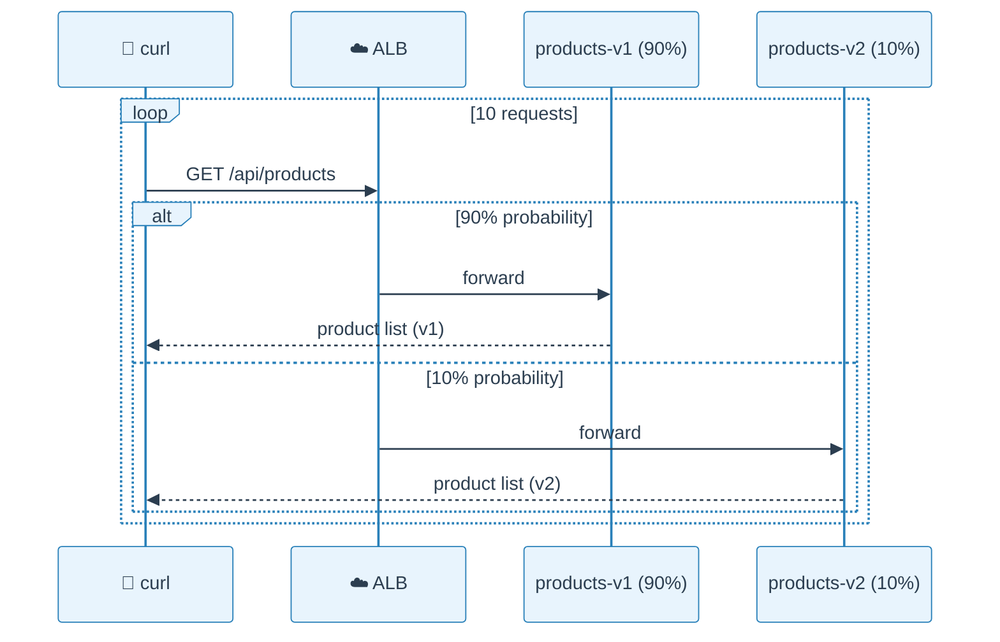
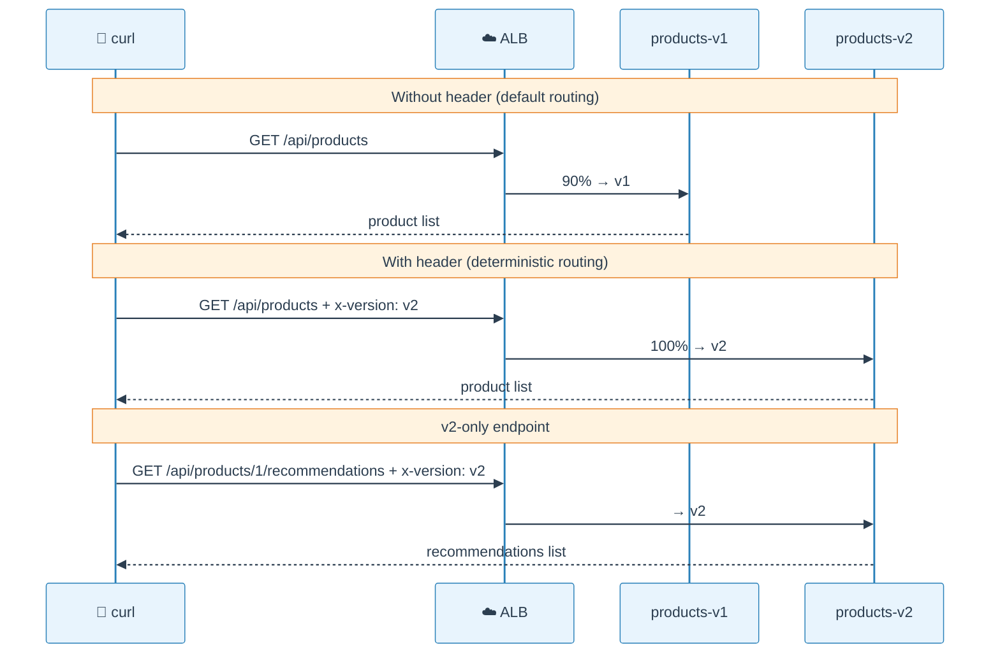
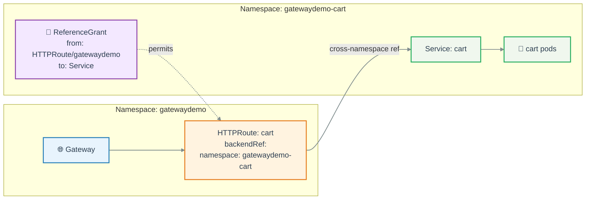
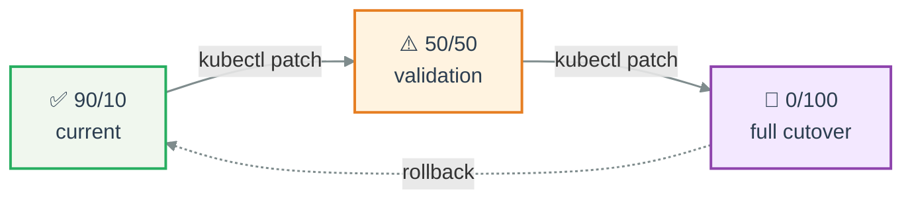

# Lab 3: Gateway API Demo Scenarios

Hands-on scenarios demonstrating Gateway API capabilities that are impossible or cumbersome with Ingress.

**Duration:** ~20 minutes

**Prerequisite:** Gateway API resources deployed (`kubectl apply -f manifests/04-gateway-api/`).

## Scenarios Overview



---

## Scenario 3.1: Traffic Splitting (90/10)

HTTPRoute sends 90% of `/api/products` traffic to products-v1 and 10% to products-v2.

### How it works



### HTTPRoute config

```bash
kubectl -n gatewaydemo get httproute products -o yaml | grep -A8 'backendRefs'
```

```yaml
# Rule 2: Weighted traffic split
backendRefs:
  - name: products-v1
    port: 80
    weight: 90
  - name: products-v2
    port: 80
    weight: 10
```

### Try it

```bash
# Send 10 requests -- responses come from v1 or v2 based on weights
for i in $(seq 1 10); do
  curl -s https://gateway-demo.vedmich.dev/api/products | jq '.[0].name'
done
```

Expected: most responses return product data. With 90/10 split, ~1 in 10 may differ.

> **Ingress comparison:** NGINX Ingress requires a separate canary Ingress resource with `canary-weight` annotation. ALB Ingress requires a JSON blob in `actions.*` annotation. Gateway API: a typed `weight` field.

---

## Scenario 3.2: Header-Based Routing

The `x-version: v2` header routes requests directly to products-v2, bypassing the traffic split.

### How it works



### HTTPRoute config

HTTPRoute uses **rule ordering** -- the header match rule comes first (higher priority):

```yaml
rules:
  # Rule 1: Header match (evaluated first)
  - matches:
      - path: { type: PathPrefix, value: /api/products }
        headers:
          - name: x-version
            value: v2
    backendRefs:
      - name: products-v2
        port: 80

  # Rule 2: Default with traffic split (fallback)
  - matches:
      - path: { type: PathPrefix, value: /api/products }
    backendRefs:
      - name: products-v1
        port: 80
        weight: 90
      - name: products-v2
        port: 80
        weight: 10
```

### Try it

```bash
# Without header -- default routing (v1 or split)
curl -s https://gateway-demo.vedmich.dev/api/products/1 | jq .name
# Expected: "Wireless Keyboard"

# With header -- deterministic routing to v2
curl -s -H "x-version: v2" https://gateway-demo.vedmich.dev/api/products/1 | jq .name
# Expected: "Wireless Keyboard"

# v2-only endpoint: recommendations (only products-v2 has this)
curl -s -H "x-version: v2" \
  https://gateway-demo.vedmich.dev/api/products/1/recommendations | jq
# Expected:
# [
#   {"id": 3, "name": "Laptop Stand", "reason": "Popular with keyboard buyers"},
#   {"id": 5, "name": "Monitor Light Bar", "reason": "Complete your desk setup"}
# ]

# Without header, /recommendations returns 404 (v1 doesn't have it)
curl -s https://gateway-demo.vedmich.dev/api/products/1/recommendations
# Expected: 404 (most of the time -- 10% chance of hitting v2)
```

> **Use case:** QA team tests v2 via header while production traffic stays on v1. No separate environments needed.

---

## Scenario 3.3: Cross-Namespace Routing

Cart service lives in `gatewaydemo-cart` namespace. Gateway API routes to it via ReferenceGrant.

### How it works



**Security model:** Both sides must agree:
1. **HTTPRoute** (in `gatewaydemo`) declares `namespace: gatewaydemo-cart` in backendRef
2. **ReferenceGrant** (in `gatewaydemo-cart`) explicitly allows HTTPRoutes from `gatewaydemo`

Without the ReferenceGrant, the ALB Controller rejects the route.

### Try it

```bash
# Show the cross-namespace setup
kubectl -n gatewaydemo-cart get referencegrant
# Expected: allow-gatewaydemo-routes

# Empty cart
curl -s https://gateway-demo.vedmich.dev/api/cart/demo-user | jq
# Expected: {"user_id": "demo-user", "items": [], "total": 0}

# Add item to cart
curl -s -X POST https://gateway-demo.vedmich.dev/api/cart \
  -H "Content-Type: application/json" \
  -d '{"user_id":"demo-user","product_id":1,"name":"Wireless Keyboard","price":49.99}' | jq
# Expected:
# {
#   "user_id": "demo-user",
#   "items": [{"product_id": 1, "name": "Wireless Keyboard", "price": 49.99, "quantity": 1}],
#   "total": 49.99
# }

# Verify cart persists
curl -s https://gateway-demo.vedmich.dev/api/cart/demo-user | jq .total
# Expected: 49.99
```

> **Ingress comparison:** This is **impossible** with `kind: Ingress` -- Ingress can only reference Services in its own namespace. The cart route in our NGINX/ALB Ingress manifests returns 503.

---

## Scenario 3.4: Canary Deployment (Progressive Rollout)

Demonstrate changing traffic weights live -- zero downtime, no redeployment.

### Rollout plan



### Try it

**Check current state (90/10):**

```bash
kubectl -n gatewaydemo get httproute products \
  -o jsonpath='{.spec.rules[1].backendRefs[*].weight}'
# Expected: 90 10
```

**Shift to 50/50:**

```bash
kubectl -n gatewaydemo patch httproute products --type=json \
  -p='[
    {"op":"replace","path":"/spec/rules/1/backendRefs/0/weight","value":50},
    {"op":"replace","path":"/spec/rules/1/backendRefs/1/weight","value":50}
  ]'
```

```bash
kubectl -n gatewaydemo get httproute products \
  -o jsonpath='{.spec.rules[1].backendRefs[*].weight}'
# Expected: 50 50
```

**Full cutover to v2 (0/100):**

```bash
kubectl -n gatewaydemo patch httproute products --type=json \
  -p='[
    {"op":"replace","path":"/spec/rules/1/backendRefs/0/weight","value":0},
    {"op":"replace","path":"/spec/rules/1/backendRefs/1/weight","value":100}
  ]'
```

**Rollback to 90/10:**

```bash
kubectl -n gatewaydemo patch httproute products --type=json \
  -p='[
    {"op":"replace","path":"/spec/rules/1/backendRefs/0/weight","value":90},
    {"op":"replace","path":"/spec/rules/1/backendRefs/1/weight","value":10}
  ]'
```

> **Key point:** Weight changes are applied by the ALB Controller within seconds. No pod restarts, no redeployment. Compare with Ingress where you'd need to modify annotation JSON blobs or manage separate canary Ingress resources.

---

## Scenario 3.5: TLS Verification

```bash
# Verify TLS certificate (ACM auto-discovery)
curl -v https://gateway-demo.vedmich.dev/api/products 2>&1 | grep -E 'subject:|issuer:'
# Expected:
# *  subject: CN=gateway-demo.vedmich.dev
# *  issuer: C=US; O=Amazon; CN=Amazon RSA 2048 M03

# Verify HTTPS returns 200
curl -s -o /dev/null -w "%{http_code}" https://gateway-demo.vedmich.dev/api/products
# Expected: 200
```

> **How it works:** The Gateway listener declares `hostname: gateway-demo.vedmich.dev` and `tls.mode: Terminate`. AWS ALB Controller automatically finds the matching ACM certificate. No certificate ARN annotation, no K8s Secret needed.

---

## Scenario 3.6: Run Full E2E Test Suite

```bash
task test:e2e
```

This runs 6 test files against the live cluster:

| Test File | What It Verifies |
|-----------|-----------------|
| `test_gateway_api.py` | Gateway + HTTPRoutes exist and are programmed |
| `test_traffic_split.py` | Both v1 and v2 receive traffic |
| `test_header_routing.py` | `x-version: v2` routes to v2, recommendations work |
| `test_cross_namespace.py` | Cart accessible cross-namespace |
| `test_ingress_nginx.py` | NGINX Ingress baseline (skip if not deployed) |
| `test_ingress_alb.py` | ALB Ingress baseline (skip if not deployed) |

---

## Cleanup

```bash
# Remove Gateway API resources
kubectl delete -f manifests/04-gateway-api/

# Full teardown (removes EKS, VPC, ACM, ECR -- ~10 min)
task teardown
```

All AWS resources are tagged `Project=vedmich-gatewaydemo` for easy identification.
